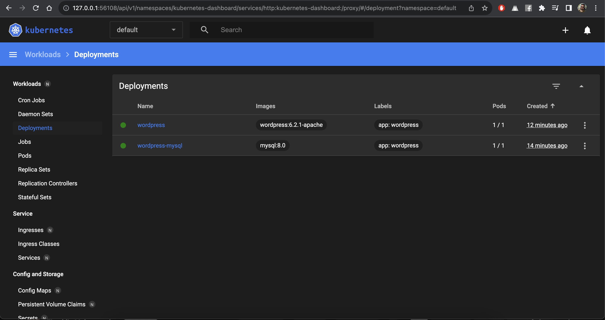
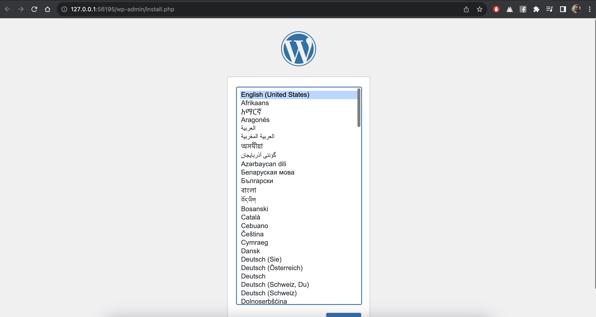

# Verify Deployments

## Intro
We can use basic verifications to make sure that all the previous steps were successful. 

## Note
Kubernetes will pull the MySQL & WordPress images from Docker Hub, so this will take some time for the pods to be in a running state. There might be some errors in Kubernetes dashboard but they will disappear after a few minutes.


## Steps

1. Run the following command:

    ```
    kubectl get pods
    ```
    You should see the following output:
    ```
    ➜  wordpress-minikube git:(main) ✗ kubectl get pods
    NAME                              READY   STATUS    RESTARTS   AGE
    wordpress-78bb764d54-x8r67        1/1     Running   0          8m7s
    wordpress-mysql-b759dbb45-tnhd4   1/1     Running   0          10m
    ```
2. Alternitively, you can run:
    ```
    minikube dashboard
    ```
    This will take you to a good looking Kubernetes dashboard page that looks like this:
    

3. Once the deployments are running, get the URL of WordPress service to install it & access the UI. Run the following command:
    ```
    minikube service wordpress --url
    ```
    The output should look like this:
    ```
    ➜  wordpress-minikube git:(main) ✗ minikube service wordpress --url
    http://127.0.0.1:56195
    ```
4. Navigate to the url from the previous step and proceed with the Wordpress installation


5. Congratulations, you have successfully verified your deployed WordPress application!
