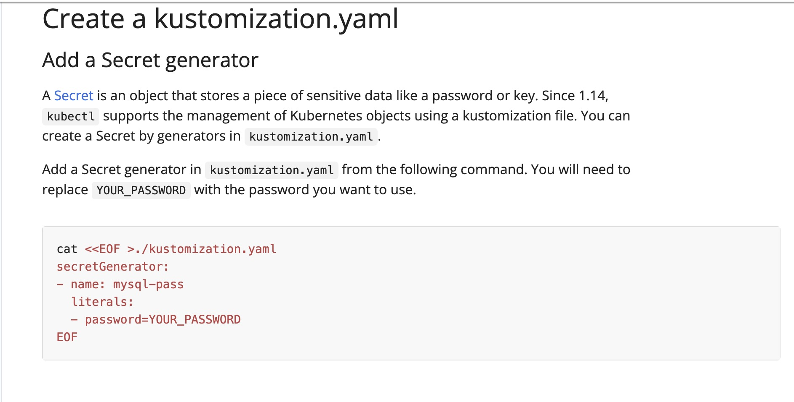
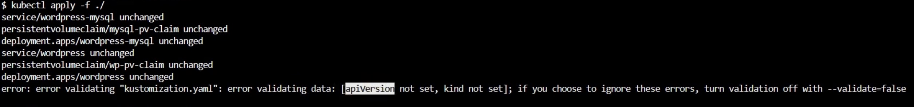

## Problem
When following the instructions on [creating kustomization.yaml file](https://kubernetes.io/docs/tutorials/stateful-application/mysql-wordpress-persistent-volume/#create-a-kustomization-yaml) on the Kubernetes webpage, it suggests adding a Secret Generator using a cat command:


However, when deploying the file using `kubectl` command, it complains on validating data:



## Solution
Use the `Secret` kind in the kustomization.yaml file instead of the `Secret Generator`.

```
---
apiVersion: v1
kind: Secret
metadata:
  name: mysql-pass
type: Opaque
data:
  password: <PASSWORD>
```
